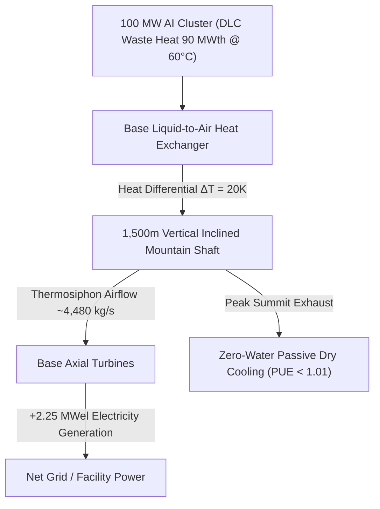

# Alpine Updraft AI Data Center

[](LICENSE)
[](LICENSE)
[](paper.tex)
[](#)

> **Thermodynamische und techno-ökonomische Bewertung unterirdischer Naturzug-Schrägschächte zur passiven Kühlung und Energierückgewinnung in Hyperscale-KI-Rechenzentren**  
> **Autor:** Chu Duc Kien ([mailiekien@icloud.com](mailto:mailiekien@icloud.com))

---

## 📌 Executive Summary

Modern AI clusters (Nvidia H100 / H200 / B200) require datacenter power capacities in the hundreds of megawatts. Heat dissipation from Direct Liquid Cooling (DLC) at 55–65 °C creates a severe environmental bottleneck: conventional dry cooling demands megawatts of parasitic fan power, while evaporative cooling consumes billions of liters of fresh water per year.

This repository presents an open infrastructure research paper proposing the coupling of a **100 MW AI datacenter** with a **1,500m inclined underground mountain shaft** (3,000m tunnel at 30° slope) in alpine geology.



---

## 🚀 Key Performance Indicators (KPIs)

| Metric | Industry Standard (100 MW) | Alpine Updraft Shaft | Impact |
|---|---|---|---|
| **PUE (Power Usage Effectiveness)** | 1.15 – 1.25 | **< 1.01** (Net ~1.0075) | Eliminates ~4 MW fan power |
| **WUE (Water Usage Effectiveness)** | 1.5 – 2.0 L/kWh (~1.58B L/yr) | **0.0 L/kWh** | **100% Zero Water Consumption** |
| **Energy Recovery** | 0.0 MW | **+2.25 MWel Net** | Recovers power via base turbines |
| **Annual OPEX Savings** | Baseline | **~$10.17 Million / year** | Electricity + Water + Maintenance |
| **50-Year Net Present Value (NPV50)** | Baseline | **+$162.3 Million** | Amortizes $198M Tunneling CapEx |

---

## 📁 Repository Structure

```
├── paper.tex              # Complete IEEEtran LaTeX paper (ready to compile)
├── paper_konzept.md       # Comprehensive German markdown summary & analysis
├── README.md              # Project overview & quickstart
├── CITATION.cff           # Citation metadata for academic references
├── LICENSE                # Open Research License (MIT & CC-BY-4.0)
├── HACKER_NEWS_POST.md    # Launch strategy & submission text for Hacker News
└── TWITTER_THREAD.md      # Launch copy & thread structure for X/Twitter
```

---

## 🛠️ How to Compile the LaTeX Paper

You can compile [`paper.tex`](file:///Users/chuk/.gemini/antigravity/scratch/rechenzenter/paper.tex) locally using TeX Live / MacTeX, or online via Overleaf:

```bash
# Using pdflatex
pdflatex paper.tex
bibtex paper
pdflatex paper.tex
pdflatex paper.tex

# Or using Tectonic
tectonic paper.tex
```

---

## 📖 Citation

If you use this research, formulas, or concepts in your work, please cite it using BibTeX:

```bibtex
@techreport{alpine_updraft_datacenter_2026,
  title={Thermodynamische und techno-oekonomische Bewertung unterirdischer Naturzug-Schraegschaechte zur passiven Kuehlung und Energierueckgewinnung in Hyperscale-KI-Rechenzentren},
  author={Alpine Data Center Open Research Group},
  year={2026},
  institution={Open Science Initiative},
  url={https://github.com/KienCD-hash/alpine-updraft-datacenter}
}
```

---

## 📜 License

Distributed under the [MIT License](LICENSE) and [Creative Commons Attribution 4.0 International](https://creativecommons.org/licenses/by/4.0/).
