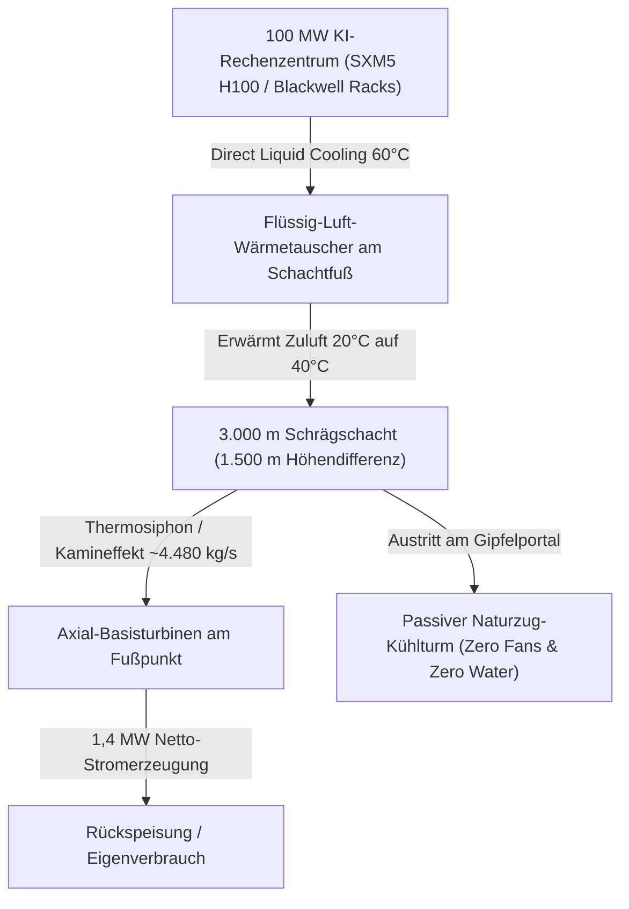

# Thermodynamische und techno-ökonomische Bewertung unterirdischer Naturzug-Schrägschächte zur passiven Kühlung und Energierückgewinnung in Hyperscale-KI-Rechenzentren

**Autor:** Chu Duc Kien (mailiekien@icloud.com)  
**Status:** Preprint, Revision v2 (Zahlen nach unabhängiger Nachrechnung korrigiert, siehe Revisionsvermerk in paper.tex)  
**Datum:** 11. September 2026  
**Format:** IEEEtran / Academic Research Paper  

---

## Abstract
Der exponentielle Anstieg von Trainingslasten künstlicher Intelligenz erfordert Rechenzentrumsleistungen im dreistelligen Megawatt-Bereich. Herkömmliche Kühlinfrastrukturen stoßen durch extremen Hilfsstrombedarf (Power Usage Effectiveness, PUE) und massiven Frischwasserverbrauch (Water Usage Effectiveness, WUE) an ökologische und infrastrukturelle Grenzen. Dieser Beitrag untersucht ein neuartiges Anlagenkonzept: die Kopplung eines flüssigkeitsgekühlten 100-MW-KI-Rechenzentrums mit einem bergmännisch aufgefahrenen Schrägschacht ($\Delta z = 1.500\,\text{m}$) zur Realisierung eines passiven Naturzug-Kühlsystems mit integrierter Energierückgewinnung. 

Thermodynamische Berechnungen zeigen, dass bei einer Kühlwassertemperatur von $60\,^\circ\text{C}$ ein kontinuierlicher Auftrieb mit einem Massenstrom von rund $4.480\,\text{kg/s}$ induziert wird. Neben der vollständigen Eliminierung des mechanischen Kühlstrombedarfs ($\sim 4{,}0\,\text{MW}_{\text{el}}$) und des jährlichen Wasserbedarfs ($\sim 1{,}58 \cdot 10^6\,\text{m}^3$) ermöglicht eine Basisturbine die Rückspeisung von rund $1{,}4\,\text{MW}_{\text{el}}$, wodurch der rechnerische PUE auf etwa **1,016** sinkt. Eine techno-ökonomische Lebenszyklusanalyse ergibt jährliche Betriebskosteneinsparungen von rund **9,4 Mio. Euro**; bei 198 Mio. Euro Netto-Mehrinvestition und 6 % Kalkulationszins bleibt der Kapitalwert über 50 Jahre im Basisszenario jedoch **negativ (≈ −49 Mio. Euro)**. Positiv wird er erst bei deutlich höheren Strom- oder Wasserpreisen.

---

## Key Performance Indicators (KPIs)

| Metrik / Parameter | Konventionelles RZ (100 MW) | Alpine Hangkanal-Kopplung | Vorteil |
|---|---|---|---|
| **PUE (Power Usage Effectiveness)** | 1,15 – 1,25 | **~1,016** (1,03 ohne Turbinengutschrift) | Eliminierung von ~4 MW Kühlstrom |
| **WUE (Water Usage Effectiveness)** | 1,5 – 2,0 L/kWh (~1,58 Mrd. L/Jahr) | **0,0 L/kWh** | 100% Einsparung von Trinkwasser |
| **Rückverstromung (Turbine)** | 0,0 MW | **+1,41 MWel** | Nur ~41 % des Auftriebs stehen der Turbine zur Verfügung, der Rest geht in Reibung/Wärmetauscher |
| **Jährliche OPEX-Ersparnis** | Reference | **~9,43 Mio. € / Jahr** | Kühlstrom + Wasser + Wartung + Turbine |
| **50-Jahre Kapitalwert (NPV50, r = 6 %)** | Reference | **−49,3 Mio. €** (Basis) | ~198 Mio. € Netto-CapEx werden bei 0,10 €/kWh und 2,50 €/m³ nicht amortisiert; positiv erst ab ~5 €/m³ Wasser oder kombiniert hohen Preisen |

---

## Systemarchitektur & Kernerkenntnisse

### Die 3 Kernhebel des Konzepts:
1. **Der Perspektivenwechsel (Vom Kraftwerk zum Kühler):**  
   Klassische Solar- / Aufwindkraftwerke scheiterten historisch oft an niedrigen Wirkungsgraden (2–5%). Als **passiver Kühler** genutzt, kehrt sich die Logik um: Der Schacht ersetzt teure Lüfterwände und Chiller, spart ~4 MW Hilfsstrom und liefert als *Nebenprodukt* rund 1,4 MW echten Strom. Der wirtschaftliche Kern liegt in der vermiedenen Hilfsenergie und dem vermiedenen Wasserbezug (~79 % der Ersparnis), nicht in der Turbine (~13 %).
2. **Zero Water Consumption:**  
   Keine evaporative Kühlung. Vermeidet den Verbrauch von 1,58 Milliarden Litern Trinkwasser pro Jahr.
3. **Physische Resilienz im Berg:**  
   Unterirdische Kaverne im Granit-/Gneisgestein bietet Höchstschutz vor Witterung, Lawinen, EMP und Sabotage.

---

## Projektdateien im Workspace

- [`paper.tex`](file:///Users/chuk/.gemini/antigravity/scratch/rechenzenter/paper.tex) - Vollständiger, kompilierbarer LaTeX-Code im IEEEtran-Format.
- [`paper_konzept.md`](file:///Users/chuk/.gemini/antigravity/scratch/rechenzenter/paper_konzept.md) - Diese Dokumentation.
- [`README.md`](file:///Users/chuk/.gemini/antigravity/scratch/rechenzenter/README.md) - Projekt-Übersicht & Anleitung.
